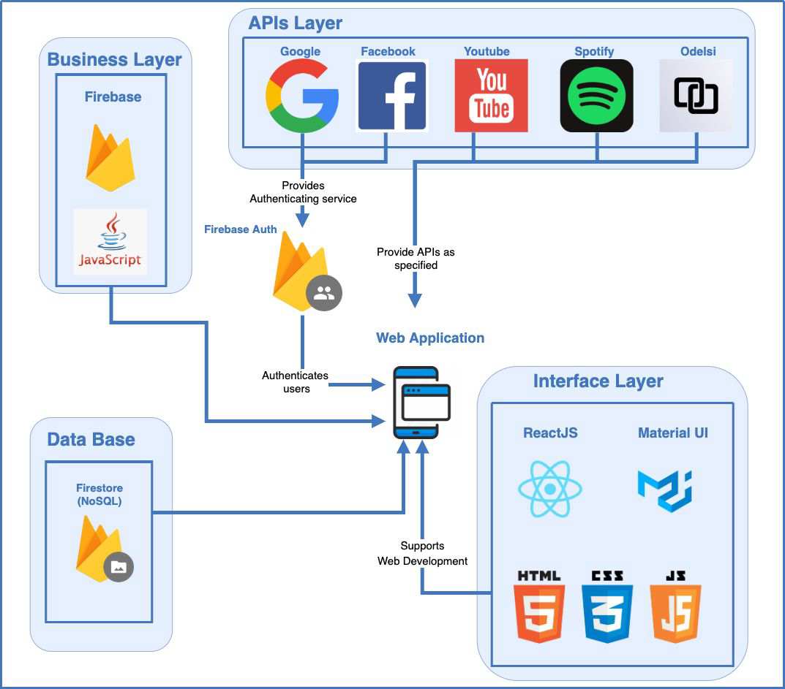
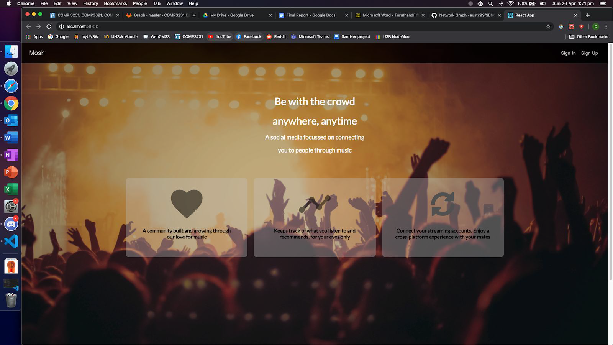
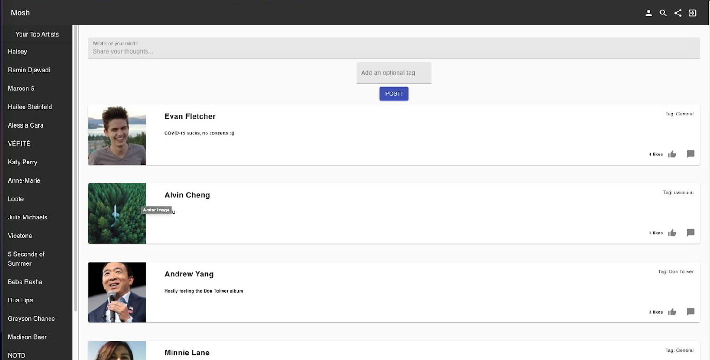
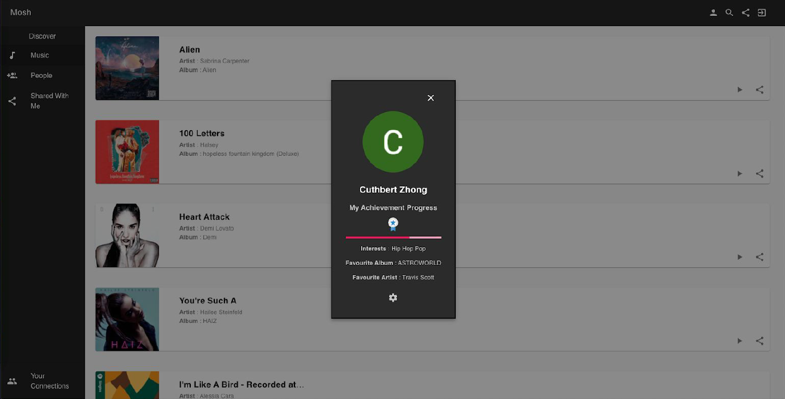
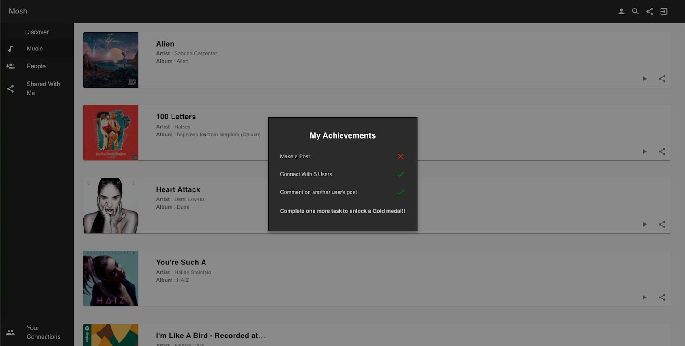
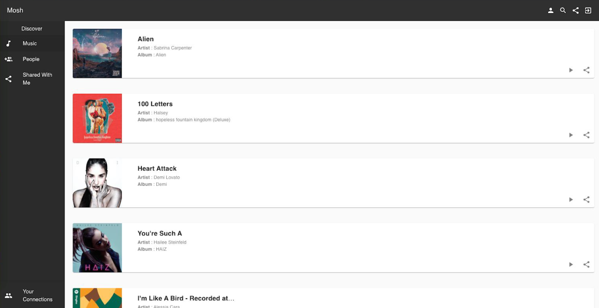
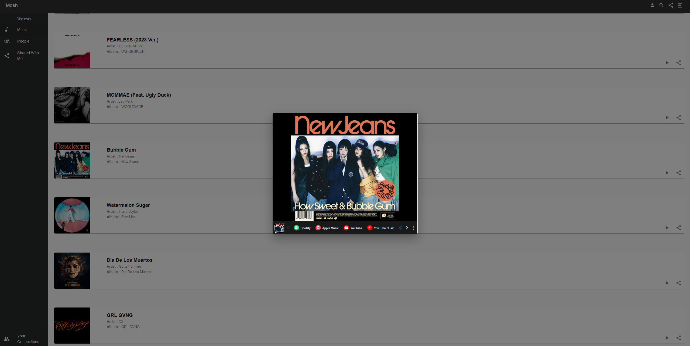
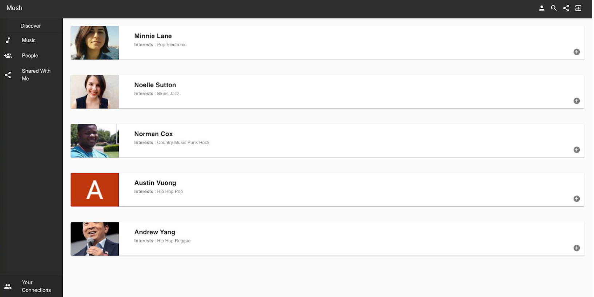
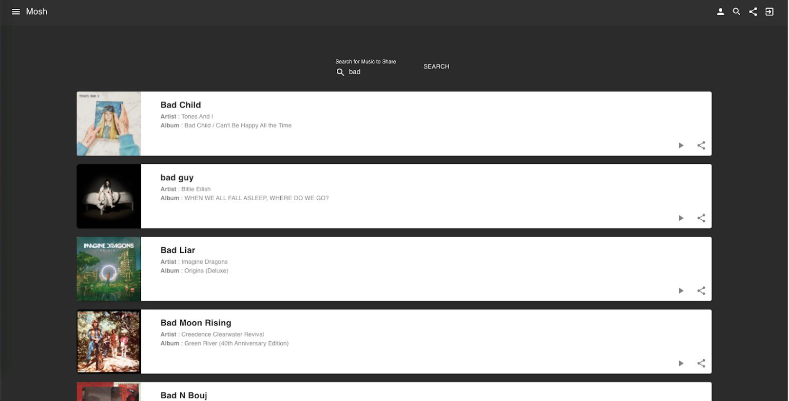
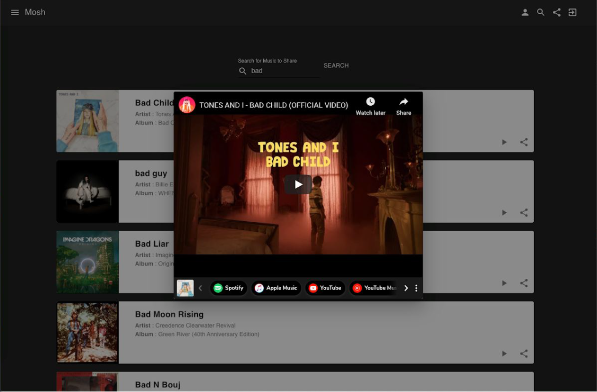

# Mosh

A social media platform aimed at connecting people through music. Users can share and discover new music and people across streaming platforms such as Spotify and Youtube.

With Mosh’s unique purpose and the endless possibilities provided by the streaming service
industry whether it is through the data they collect or the number of users they attract, Mosh is
able to deliver innovative features that have the potential to create a more holistic and
interactive music community online.

Key Features:
- A social media experience created through posts, communities and connections.
- A platform that centralises a user’s music recommendations enabling users to discover
new music and people with similar taste.
- A personalised experience that continues to evolve as a user’s music taste changes.
- Communities growing through similar music taste and favourite artists.
- Ability to play and easily share music they discover across streaming service platforms,
encouraging shared experiences through music.

Usage: 
(Web Demo)
- NOTE: Was being maintained by other members but is no longer so features may not work
mosh-37501.web.app/

(Local Hosting)
- First run the backend
cd source-code/mosh/src
cd auth-server/authorization_code
node app.js
- Then run the frontend
// In a separate terminal
cd ../../
yarn start

Note: for backend don't need to replace spotify api secret/id

Software Architecture:

Final Interface Screenshots:
- Landing Page

- Connect Page

- User Feed (Home Page)

- User Profile

- Discover Music Page

- Discover People/Connections Page

- Share Page

- Music Media Page
